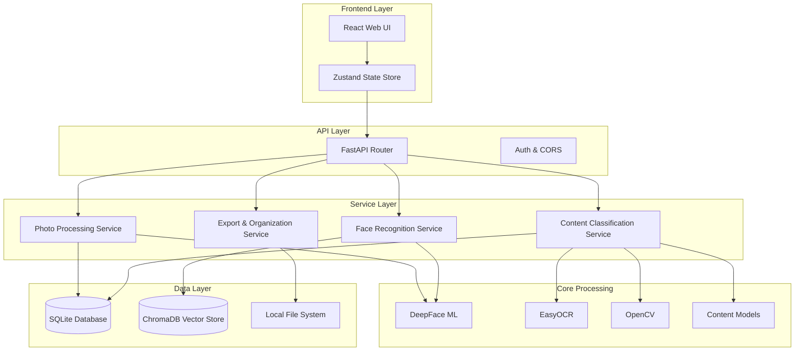
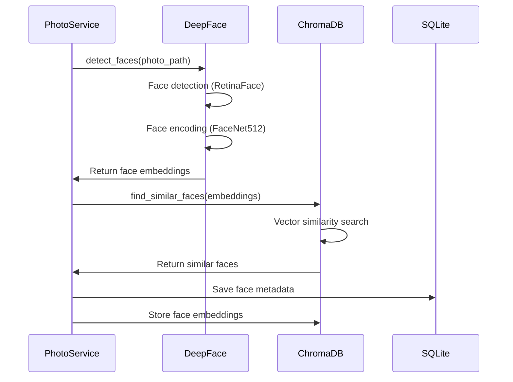
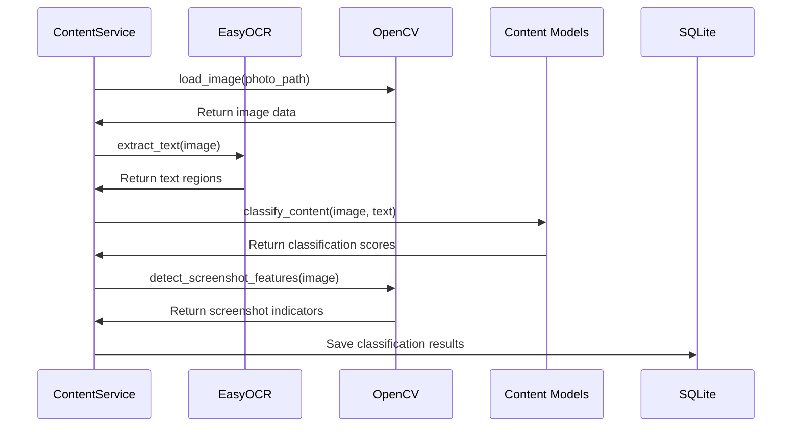

# Architecture

## Overview

The Photo Organizer follows a modular, service-oriented architecture with clear separation of concerns between data processing, business logic, and presentation layers.

## Current Implementation (January 2026)

This document includes target-state architecture. The items below reflect what is
implemented today so the docs stay aligned during development.

### Implemented Modules

- **Settings (single source of truth)**: `src/photo_organiser/config/settings.py`
    - Pydantic Settings with nested groups (database/chroma/storage/logging/etc.)
    - Creates required directories on startup
    - Accepts `SECURITY_SECRET_KEY` (or legacy `SECRET_KEY`)

- **Database**: `src/photo_organiser/core/database.py`
    - SQLAlchemy engine/session management, create/drop schema helpers
    - SQLite foreign-key PRAGMA hook

- **Models**: `src/photo_organiser/models/database.py`
    - SQLAlchemy 2.x style declarative base
    - Core entities: Photo, Face, Person, ProcessingLog, etc.

- **Service Layer**: `src/photo_organiser/services/photo_service.py`
    - `PhotoProcessingService` supports directory scanning + batch processing
    - Metadata extraction uses Pillow; unsupported/corrupt images are handled
        gracefully (file size still recorded)

- **CLI / Entrypoints**: `src/photo_organiser/cli.py`
    - Run via `uv run photo-organiser ...` or `uv run python -m photo_organiser ...`
    - Commands include `init-db`, `db-status`, `scan-photos`

### Developer Smoke Checks

- Combined smoke runner (temp DB + temp storage dirs): `uv run python -m scripts.run_smoke`
- Regenerate local image fixtures (if needed): `uv run python scripts/generate_test_photos.py`

### Format Support Note (HEIC/HEIF)

HEIC/HEIF decoding is not enabled by default. If required, add a decoder plugin
(for example `pillow-heif`) and ensure the system has `libheif` available.

## System Architecture



## Component Architecture

### 1. Frontend Architecture

#### Technology Stack
- **React 18**: Component-based UI framework
- **TypeScript**: Type-safe JavaScript
- **Tailwind CSS**: Utility-first CSS framework
- **Zustand**: Lightweight state management
- **React Query**: Server state management and caching
- **React Router**: Client-side routing

#### Component Structure
```
src/
├── components/           # Reusable UI components
│   ├── ui/             # Basic UI elements (buttons, inputs)
│   ├── layout/         # Layout components (header, sidebar)
│   ├── gallery/        # Photo gallery components
│   ├── faces/          # Face management components
│   └── review/         # Review workflow components
├── pages/              # Page-level components
├── hooks/              # Custom React hooks
├── stores/             # Zustand stores
├── services/           # API service functions
├── types/              # TypeScript type definitions
└── utils/              # Frontend utilities
```

#### State Management
```typescript
// Global stores for different application domains
interface PhotoStore {
  photos: Photo[]
  selectedPhotos: Set<string>
  filters: FilterOptions
  loading: boolean
  error: string | null
}

interface FaceStore {
  faceGroups: FaceGroup[]
  selectedPerson: Person | null
  persons: Person[]
  clusteringStatus: ClusteringStatus
}

interface ReviewStore {
  reviewQueue: Photo[]
  currentIndex: number
  decisions: ReviewDecision[]
  isPaused: boolean
  session: ReviewSession | null
}
```

### 2. Backend Architecture

#### Technology Stack
- **FastAPI**: High-performance async web framework
- **SQLAlchemy**: Database ORM with Alembic migrations
- **ChromaDB**: Vector database for face embeddings
- **Pydantic**: Data validation and serialization
- **Loguru**: Structured logging

#### Service Layer Design
```python
# Service interfaces for dependency injection
class PhotoProcessingService(ABC):
    @abstractmethod
    async def process_photo_batch(self, photo_paths: List[Path]) -> ProcessingResult:
        pass
    
    @abstractmethod
    async def get_processing_status(self, batch_id: str) -> ProcessingStatus:
        pass

class FaceRecognitionService(ABC):
    @abstractmethod
    async def detect_faces(self, photo_path: Path) -> List[Face]:
        pass
    
    @abstractmethod
    async def cluster_faces(self, faces: List[Face]) -> List[FaceGroup]:
        pass
    
    @abstractmethod
    async def assign_to_person(self, face_ids: List[str], person_id: int) -> bool:
        pass
```

#### API Layer Structure
```
src/photo_organiser/api/
├── __init__.py
├── dependencies.py      # FastAPI dependencies
├── middleware.py        # Custom middleware
├── routes/             # API route definitions
│   ├── __init__.py
│   ├── photos.py        # Photo management endpoints
│   ├── faces.py         # Face management endpoints
│   ├── persons.py       # Person management endpoints
│   ├── content.py       # Content classification endpoints
│   ├── review.py        # Review workflow endpoints
│   └── export.py        # Export/organization endpoints
└── schemas/             # Pydantic models
    ├── __init__.py
    ├── photo.py
    ├── face.py
    ├── person.py
    ├── content.py
    └── review.py
```

### 3. ML/AI Processing Architecture

#### Face Recognition Pipeline


#### Content Classification Pipeline


#### Model Architecture
```python
# Face processing models
class FaceDetectionModel:
    backend: str = "retinaface"  # opencv, ssd, mtcnn, dlib, retinaface
    confidence_threshold: float = 0.9
    extract_faces: bool = True

class FaceRecognitionModel:
    model_name: str = "Facenet512"  # VGG-Face, Facenet, Facenet512, ArcFace
    distance_metric: str = "cosine"
    detector_backend: str = "retinaface"

# Content classification models
class ContentClassifier:
    text_threshold: float = 0.7
    image_threshold: float = 0.8
    meme_patterns: List[str] = [...]
    screenshot_indicators: List[str] = [...]
```

## Data Architecture

### Database Schema

#### SQLite Schema
```sql
-- Core photo metadata
CREATE TABLE photos (
    id INTEGER PRIMARY KEY AUTOINCREMENT,
    file_path TEXT UNIQUE NOT NULL,
    file_hash TEXT NOT NULL,
    width INTEGER,
    height INTEGER,
    file_size INTEGER,
    created_date TIMESTAMP,
    modified_date TIMESTAMP,
    mime_type TEXT,
    has_faces BOOLEAN DEFAULT FALSE,
    face_count INTEGER DEFAULT 0,
    has_text BOOLEAN DEFAULT FALSE,
    text_content TEXT,
    is_screenshot BOOLEAN DEFAULT FALSE,
    content_type TEXT,
    processing_status TEXT DEFAULT 'pending',
    processed_at TIMESTAMP DEFAULT CURRENT_TIMESTAMP,
    INDEX idx_file_path (file_path),
    INDEX idx_processing_status (processing_status),
    INDEX idx_content_type (content_type)
);

-- Person management
CREATE TABLE persons (
    id INTEGER PRIMARY KEY AUTOINCREMENT,
    name TEXT NOT NULL,
    display_name TEXT,
    face_count INTEGER DEFAULT 0,
    created_at TIMESTAMP DEFAULT CURRENT_TIMESTAMP,
    updated_at TIMESTAMP DEFAULT CURRENT_TIMESTAMP,
    UNIQUE(name)
);

-- Face metadata
CREATE TABLE faces (
    id INTEGER PRIMARY KEY AUTOINCREMENT,
    photo_id INTEGER,
    embedding_id TEXT NOT NULL,  # Reference to ChromaDB embedding
    bbox_x INTEGER,
    bbox_y INTEGER,
    bbox_width INTEGER,
    bbox_height INTEGER,
    confidence REAL,
    person_id INTEGER,
    created_at TIMESTAMP DEFAULT CURRENT_TIMESTAMP,
    FOREIGN KEY (photo_id) REFERENCES photos (id),
    FOREIGN KEY (person_id) REFERENCES persons (id),
    INDEX idx_photo_id (photo_id),
    INDEX idx_person_id (person_id)
);

-- Face person assignments (many-to-many relationship)
CREATE TABLE face_person_assignments (
    id INTEGER PRIMARY KEY AUTOINCREMENT,
    face_id TEXT NOT NULL,
    person_id INTEGER,
    photo_id INTEGER,
    confidence REAL,
    created_at TIMESTAMP DEFAULT CURRENT_TIMESTAMP,
    FOREIGN KEY (person_id) REFERENCES persons (id),
    FOREIGN KEY (photo_id) REFERENCES photos (id),
    INDEX idx_face_id (face_id),
    INDEX idx_person_id (person_id)
);

-- Processing logs
CREATE TABLE processing_logs (
    id INTEGER PRIMARY KEY AUTOINCREMENT,
    photo_id INTEGER,
    operation TEXT,
    status TEXT,
    error_message TEXT,
    processing_time_ms INTEGER,
    created_at TIMESTAMP DEFAULT CURRENT_TIMESTAMP,
    FOREIGN KEY (photo_id) REFERENCES photos (id),
    INDEX idx_photo_id (photo_id),
    INDEX idx_operation (operation),
    INDEX idx_status (status)
);
```

#### ChromaDB Schema
```python
# Face embeddings collection
face_collection_schema = {
    "name": "face_embeddings",
    "metadata": {
        "photo_path": str,
        "face_index": int,
        "confidence": float,
        "bbox": str,  # JSON string
        "person_id": Optional[int],
        "created_at": str
    },
    "embedding_dimension": 512,  # FaceNet512 dimension
    "hnsw:space": "cosine"
}
```

### File System Organization
```
project_root/
├── data/
│   ├── photo_organizer.db      # SQLite database
│   ├── chroma_db/              # ChromaDB vector store
│   ├── thumbnails/             # Generated thumbnails
│   ├── exports/                # Exported photo collections
│   └── logs/                  # Application logs
├── uploads/                    # User-uploaded photo folders (symlinks)
└── temp/                       # Temporary processing files
```

## Processing Architecture

### Batch Processing System
```python
class BatchProcessor:
    def __init__(self, batch_size: int = 32, max_workers: int = 4):
        self.batch_size = batch_size
        self.max_workers = max_workers
        self.memory_threshold_gb = 8
        
    async def process_photo_collection(self, photo_paths: List[Path]) -> ProcessingResult:
        """Process large photo collections in memory-safe batches"""
        batches = self.create_batches(photo_paths, self.batch_size)
        
        async for batch_id, batch in self.enumerate_batches(batches):
            if self.memory_usage_exceeded():
                await self.cleanup_memory()
                
            result = await self.process_batch_with_retry(batch, batch_id)
            await self.persist_batch_result(result)
            
            if self.should_checkpoint(batch_id):
                await self.create_checkpoint(batch_id)
```

### Memory Management
```python
class MemoryManager:
    def __init__(self, threshold_gb: float = 8):
        self.threshold_gb = threshold_gb
        self.cleanup_callbacks: List[Callable] = []
        
    def register_cleanup_callback(self, callback: Callable):
        self.cleanup_callbacks.append(callback)
        
    async def cleanup_if_needed(self) -> bool:
        """Perform memory cleanup if threshold exceeded"""
        if self.get_memory_usage() > self.threshold_gb:
            logger.info("Memory threshold exceeded, performing cleanup")
            
            # Clear GPU memory if available
            if torch.cuda.is_available():
                torch.cuda.empty_cache()
                
            # Run custom cleanup callbacks
            for callback in self.cleanup_callbacks:
                await callback()
                
            # Force garbage collection
            gc.collect()
            return True
        return False
```

## Security Architecture

### File System Security
```python
class SecureFileHandler:
    def __init__(self, allowed_paths: List[Path]):
        self.allowed_paths = [Path(p).resolve() for p in allowed_paths]
        
    def validate_path(self, file_path: Path) -> bool:
        """Ensure file path is within allowed directories"""
        try:
            resolved_path = Path(file_path).resolve()
            return any(
                str(resolved_path).startswith(str(allowed_path))
                for allowed_path in self.allowed_paths
            )
        except Exception:
            return False
            
    def safe_file_operation(self, operation: Callable, *args, **kwargs):
        """Execute file operation with safety checks"""
        if all(self.validate_path(arg) for arg in args if isinstance(arg, Path)):
            return operation(*args, **kwargs)
        raise SecurityError("File path validation failed")
```

### Input Validation
```python
class PhotoUploadValidator:
    ALLOWED_MIME_TYPES = {
        "image/jpeg", "image/png", "image/heic", 
        "image/webp", "image/tiff", "image/bmp"
    }
    MAX_FILE_SIZE = 100 * 1024 * 1024  # 100MB
    
    def validate_photo_file(self, file_path: Path) -> ValidationResult:
        """Validate uploaded photo file"""
        errors = []
        
        if not file_path.exists():
            errors.append("File does not exist")
            
        if file_path.stat().st_size > self.MAX_FILE_SIZE:
            errors.append("File size exceeds maximum limit")
            
        try:
            mime_type = magic.from_file(file_path, mime=True)
            if mime_type not in self.ALLOWED_MIME_TYPES:
                errors.append(f"Unsupported file type: {mime_type}")
        except Exception:
            errors.append("Cannot determine file type")
            
        return ValidationResult(is_valid=len(errors) == 0, errors=errors)
```

## Performance Architecture

### Caching Strategy
```python
class MultiLevelCache:
    def __init__(self):
        self.memory_cache = {}  # L1: In-memory
        self.redis_cache = None   # L2: Redis (optional)
        self.file_cache = {}      # L3: File-based
        
    async def get(self, key: str, cache_type: str = "auto") -> Any:
        """Get value from cache with fallback hierarchy"""
        
        # Try memory cache first
        if key in self.memory_cache:
            return self.memory_cache[key]
            
        # Try Redis cache if available
        if self.redis_cache:
            value = await self.redis_cache.get(key)
            if value:
                self.memory_cache[key] = value  # Promote to L1
                return value
                
        # Try file cache
        if key in self.file_cache:
            value = self.file_cache[key]
            self.memory_cache[key] = value  # Promote to L1
            return value
            
        return None
        
    async def set(self, key: str, value: Any, ttl: int = 3600):
        """Set value in all cache levels"""
        self.memory_cache[key] = value
        
        if self.redis_cache:
            await self.redis_cache.set(key, value, ex=ttl)
            
        self.file_cache[key] = value
```

### Async Processing Pipeline
```python
class AsyncProcessingPipeline:
    def __init__(self, max_concurrent_tasks: int = 4):
        self.semaphore = asyncio.Semaphore(max_concurrent_tasks)
        self.task_queue = asyncio.Queue()
        self.results = {}
        
    async def add_task(self, task_id: str, coro: Callable) -> None:
        """Add task to processing queue"""
        await self.task_queue.put((task_id, coro))
        
    async def process_tasks(self) -> Dict[str, Any]:
        """Process all tasks in queue"""
        tasks = []
        
        while not self.task_queue.empty():
            task_id, coro = await self.task_queue.get()
            task = asyncio.create_task(self._process_with_semaphore(task_id, coro))
            tasks.append(task)
            
        results = await asyncio.gather(*tasks, return_exceptions=True)
        return dict(zip([t[0] for t in tasks], results))
        
    async def _process_with_semaphore(self, task_id: str, coro: Callable) -> Any:
        """Process single task with semaphore control"""
        async with self.semaphore:
            try:
                result = await coro
                self.results[task_id] = result
                return result
            except Exception as e:
                self.results[task_id] = {"error": str(e)}
                raise
```

## Testing Architecture

### Test Structure
```
tests/
├── unit/                   # Unit tests
│   ├── test_services/      # Service layer tests
│   ├── test_models/         # Model tests
│   ├── test_utils/          # Utility tests
│   └── test_api/           # API endpoint tests
├── integration/             # Integration tests
│   ├── test_workflows/      # End-to-end workflow tests
│   ├── test_ml/            # ML pipeline tests
│   └── test_performance/    # Performance tests
├── fixtures/               # Test data and fixtures
├── conftest.py            # Pytest configuration
└── helpers/               # Test helper functions
```

### Test Categories
```python
# Unit tests for core business logic
class TestFaceRecognitionService:
    def test_face_detection_accuracy(self):
        """Test face detection on known images"""
        pass
        
    def test_face_clustering_quality(self):
        """Test face clustering with synthetic data"""
        pass
        
    def test_person_assignment(self):
        """Test person assignment workflow"""
        pass

# Integration tests for complete workflows
class TestPhotoProcessingWorkflow:
    async def test_complete_photo_processing(self):
        """Test end-to-end photo processing pipeline"""
        pass
        
    async def test_face_review_workflow(self):
        """Test complete face review and tagging workflow"""
        pass

# Performance tests
class TestPerformance:
    async def test_batch_processing_speed(self):
        """Test batch processing performance with large datasets"""
        pass
        
    def test_memory_usage(self):
        """Test memory usage during processing"""
        pass
```

## Deployment Architecture

### Development Environment
```yaml
# docker-compose.dev.yml
version: '3.8'
services:
  app:
    build: .
    ports:
      - "8000:8000"
    volumes:
      - ./src:/app/src
      - ./data:/app/data
      - ./photos:/app/photos
    environment:
      - DEBUG=true
      - LOG_LEVEL=DEBUG
    depends_on:
      - db
      
  db:
    image: postgres:15
    environment:
      POSTGRES_DB: photo_organizer_dev
      POSTGRES_USER: dev
      POSTGRES_PASSWORD: dev
    volumes:
      - postgres_dev_data:/var/lib/postgresql/data
      
  redis:
    image: redis:7-alpine
    volumes:
      - redis_dev_data:/data
```

### Production Environment
```yaml
# docker-compose.prod.yml
version: '3.8'
services:
  app:
    build: .
    ports:
      - "8000:8000"
    volumes:
      - ./data:/app/data:ro
      - ./exports:/app/exports
      - user_photos:/app/photos:ro
    environment:
      - DEBUG=false
      - LOG_LEVEL=INFO
      - MAX_WORKERS=8
    deploy:
      resources:
        limits:
          memory: 8G
          cpus: '4'
    depends_on:
      - db
      
  db:
    image: postgres:15
    environment:
      POSTGRES_DB: photo_organizer
      POSTGRES_USER: ${DB_USER}
      POSTGRES_PASSWORD: ${DB_PASSWORD}
    volumes:
      - postgres_data:/var/lib/postgresql/data
    deploy:
      resources:
        limits:
          memory: 4G
          cpus: '2'
```

## Monitoring & Observability

### Logging Strategy
```python
# Structured logging with loguru
logger.configure(
    handlers=[
        {
            "sink": "logs/app.log",
            "format": "{time:YYYY-MM-DD HH:mm:ss} | {level} | {name}:{function}:{line} | {message}",
            "rotation": "100 MB",
            "retention": "30 days"
        },
        {
            "sink": "logs/error.log",
            "format": "{time:YYYY-MM-DD HH:mm:ss} | {level} | {name}:{function}:{line} | {message}",
            "level": "ERROR",
            "rotation": "50 MB",
            "retention": "90 days"
        }
    ]
)
```

### Metrics Collection
```python
class PerformanceMetrics:
    def __init__(self):
        self.processing_times = defaultdict(list)
        self.memory_usage = []
        self.error_counts = defaultdict(int)
        
    def record_processing_time(self, operation: str, duration_ms: float):
        self.processing_times[operation].append(duration_ms)
        
    def record_memory_usage(self, memory_gb: float):
        self.memory_usage.append(memory_gb)
        
    def record_error(self, error_type: str):
        self.error_counts[error_type] += 1
        
    def get_summary_stats(self) -> Dict[str, Any]:
        return {
            "avg_processing_times": {
                op: sum(times) / len(times)
                for op, times in self.processing_times.items()
            },
            "peak_memory_usage": max(self.memory_usage) if self.memory_usage else 0,
            "error_summary": dict(self.error_counts)
        }
```

This architecture provides a solid foundation for building a scalable, maintainable photo organizer application while prioritizing privacy, performance, and developer experience.